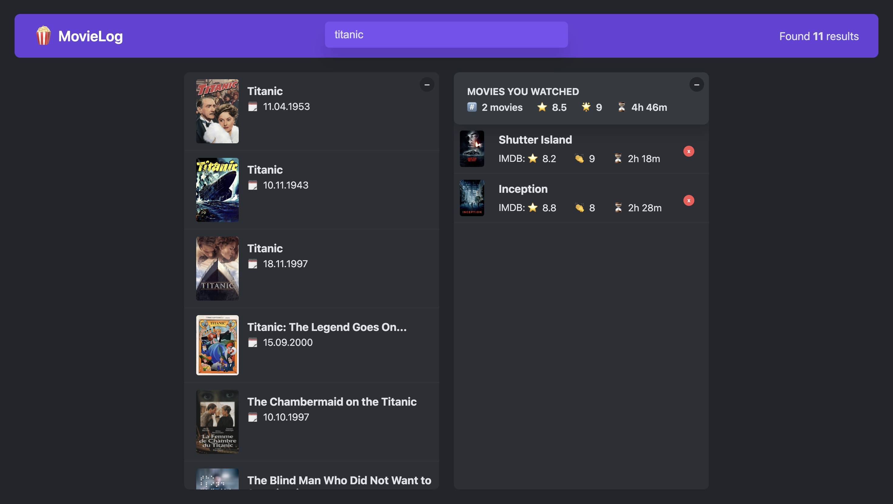

# MovieLog  



MovieLog is a React application that allows you to save the movies you've watched, rate them, and view IMDb ratings. With this project, you can keep track of the movies you've watched and the ratings you've given them. 

## Proje Demosu: [Demo Linki](https://ahmetyusufer-pizza.netlify.app)

## 🚀 Features  
- Movie search functionality  
- Viewing real IMDb ratings  
- Adding your own ratings to movies  
- Saving and listing watched movies  

## 📦 Technologies Used  
MovieLog utilizes the following technologies:  

- **React** (18.3.1)  
- **Redux Toolkit** (@reduxjs/toolkit 2.6.0)  
- **React-Redux** (9.2.0)  
- **Redux** (5.0.1)

## 🔧 Installation and Setup  
Follow these steps to run the project locally:  

1. Clone the repository:  
   ```sh
   git clone https://github.com/ahmetyusufer/MovieLog.git
   cd MovieLog
   ```
2. Install dependencies:  
   ```sh
   npm install
   ```
3. Start the application:  
   ```sh
   npm run start
   ```
4. Access it in your browser at `http://localhost:3000`.  
